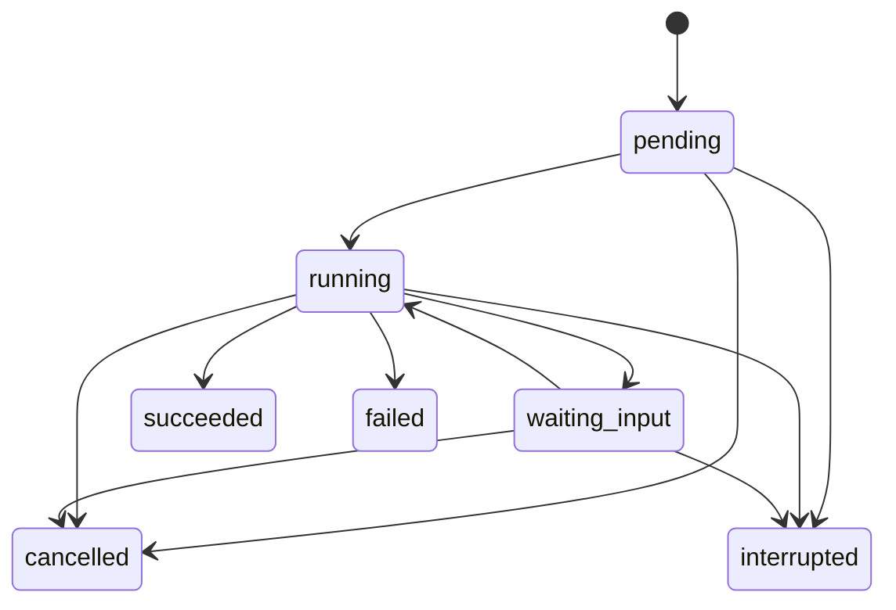
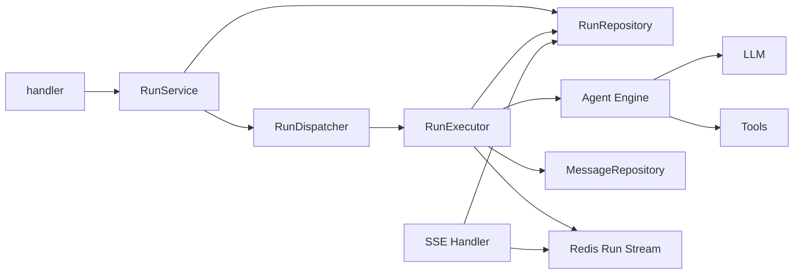

# Run/Session 重构目标架构

## 1. 背景

当前实现把长期对话、一次执行和 Redis 作业生命周期混在一起：

- `model.Session` 同时保存对话字段、`Events` 和执行 `Status`。
- `AgentService` 通过 `taskBySession` 把一个 Session 绑定到一个 `RedisStreamTask`。
- 等待用户输入通过 `ErrWaitForUser` 表达。
- 用户停止任务已经有取消优先的收敛逻辑，但终态仍通过 Flow 投影写回 Session，状态事实没有独立边界。
- Agent 动态配置已经能从数据库加载并把搜索 limit 传给 provider，但仍有 `model.AgentConfig`/`agent.AgentConfig` 两份类型，没有任务级快照。
- 进程内 `SimpleMemory` 只是运行期消息缓存；ContextBuilder 已按近似 token 预算裁剪，但尚无模型画像和输出预留。

本方案重建这些业务边界，同时保持当前模块化单体目录。

## 2. 范围

本轮包含：

- Session 与 Run 分离。
- Run、Plan、Step 显式状态机。
- 进程内 RunExecutor。
- Agent Settings 单一来源与 Run 配置快照。
- PromptCatalog 和 ContextBuilder。
- 新 Run API、SSE 和 UI 切换。
- 旧 RedisStreamTask 与 Session 执行字段删除。

本轮不包含：

- 多实例并发执行。
- Redis 作业队列、lease 或崩溃后接管。
- Transactional Outbox。
- 永久保存逐 token 或所有 UI 事件。
- 完整事件溯源。
- `domain/application/adapter/transport` 目录重排。

## 3. 业务概念

### 3.1 Session

Session 是长期对话容器。它拥有标题、最近消息、未读数和软删除信息，但不拥有执行状态。

### 3.2 Run

Run 是一次用户请求触发的 Agent 执行。一个 Session 可以有多个历史 Run，同一时间只能有一个非终态 Run。

```go
type RunStatus string

const (
    RunStatusPending      RunStatus = "pending"
    RunStatusRunning      RunStatus = "running"
    RunStatusWaitingInput RunStatus = "waiting_input"
    RunStatusSucceeded    RunStatus = "succeeded"
    RunStatusFailed       RunStatus = "failed"
    RunStatusCancelled    RunStatus = "cancelled"
    RunStatusInterrupted  RunStatus = "interrupted"
)
```

`interrupted` 表示服务重启或进程异常造成的中断。首期不自动恢复，用户可以创建新 Run。

合法迁移：



所有终态都不可再次迁移。

### 3.3 Plan 与 Step

首期每个 Run 保存一份当前 Plan JSONB 和 `plan_revision`。Go 模型使用 `PlanSnapshot`/`StepSnapshot`，强调它是 Run 当前快照；API 中仍称 plan/step。重新规划时原子替换未完成步骤并增加 revision，不单独建立 Plan 历史表。

开发阶段不保留旧 Plan 类型的长期兼容：阶段 3 先增加未接生产的 Snapshot 类型，阶段 4 生产切换后旧类型立即不可达，阶段 6 物理删除。

Plan 和 Step 使用自己的状态类型，不再共用 `ExecutionStatus`：

```go
type PlanStatus string
type StepStatus string
```

Plan 状态：`pending/running/succeeded/failed/cancelled`。

Step 状态：`pending/running/succeeded/failed/skipped/cancelled`。

### 3.4 基础设施作业

基础设施不再暴露 `Task` 领域概念。首期 `RunExecutor` 在进程内启动执行并保存 `runID -> cancel`。Redis Stream 只承载 Run 的实时输出。

## 4. 目标调用链



`RunService` 是创建、恢复、取消和查询 Run 的唯一业务入口。Handler 不直接操作 Agent Engine 或 Repository。

## 5. 数据所有权

### PostgreSQL

- Session 元数据。
- Run 状态、错误、当前 Plan、配置快照和 Prompt hash。
- 用户消息和最终助手消息。
- 文件元数据。

### Redis Stream

- `message_delta`。
- plan/step/tool/shell 等实时展示事件。
- SSE 短期断线续读游标。
- Run 结束后的有限 TTL。

Redis 数据丢失不会改变 Run 业务状态。Redis Stream 过期后，客户端通过 PostgreSQL 中的 Run、Plan 和消息快照重建页面。

## 6. 配置

### 部署配置

YAML/环境变量管理数据库、Redis、OSS、外部地址、密钥、HTTP timeout 和关闭等待时间。这些字段不通过业务 API 修改。

### 动态 Agent Settings

```go
type AgentSettings struct {
    MaxIterations    int `json:"max_iterations"`
    MaxRetries       int `json:"max_retries"`
    MaxPlanSteps     int `json:"max_plan_steps"`
    MaxSearchResults int `json:"max_search_results"`
}
```

运行时只有一个 `AgentSettings` 类型。SettingsManager 启动时读取数据库，没有记录时使用完整默认值；更新时校验、保存并原子替换。创建 Run 时把完整 Settings 保存为 JSONB 快照。

### Prompt

默认 Prompt 存在 `internal/agent/prompts/*.tmpl`，由 `go:embed` 加载。PromptCatalog 对模板内容计算 SHA-256，Run 保存该 hash。首期不实现外部目录覆盖。

## 7. Engine 契约

```go
type StepOutcomeKind string

const (
    StepOutcomeSucceeded    StepOutcomeKind = "succeeded"
    StepOutcomeFailed       StepOutcomeKind = "failed"
    StepOutcomeWaitingInput StepOutcomeKind = "waiting_input"
)

type StepOutcome struct {
    Kind        StepOutcomeKind
    Result      string
    Question    string
    Failure     *Failure
    Attachments []string
}
```

- 等待输入和业务失败通过 `StepOutcome` 返回。
- `error` 只表示 LLM、存储、协议解析或其他系统错误。
- Engine 不更新 Run 数据库状态；RunExecutor 根据 outcome 调用 RunService/Repository。

## 8. ContextBuilder

ContextBuilder 从持久化消息、当前 Plan、步骤结果和附件上下文构建 LLM 输入。首期使用可替换的保守估算器：

- ASCII 按约 4 字符/token。
- 非 ASCII 按约 1 字符/token。
- 结果乘以 `1.2` 安全系数。
- tool call 与对应 tool result 成对保留或删除。
- 优先删除旧工具输出，再删除旧对话；system、当前用户输入和最近一轮消息必须保留。

不在首期调用 LLM 自动总结历史。

## 9. 并发和一致性

### 单 Session 活跃 Run

数据库部分唯一索引保证每个 Session 最多一个 `pending/running/waiting_input` Run。

### 取消优先

终态更新使用条件 SQL：

```sql
UPDATE runs
SET status = 'succeeded', finished_at = NOW(), updated_at = NOW()
WHERE id = $1 AND status = 'running';
```

更新行数为零时重新读取 Run。若已 cancelled，执行协程不得覆盖终态。

### 服务重启

启动时将遗留的 `running` 和 `waiting_input` 标记为 `interrupted`。`pending` 也标记 interrupted，因为首期没有持久化队列保证重新派发。

## 10. API 目标

```text
POST /api/sessions
GET  /api/sessions
GET  /api/sessions/{sessionID}

POST /api/sessions/{sessionID}/runs
GET  /api/sessions/{sessionID}/runs
GET  /api/runs/{runID}
POST /api/runs/{runID}/input
POST /api/runs/{runID}/cancel
GET  /api/runs/{runID}/events

GET /api/settings/agent
PUT /api/settings/agent
```

创建 Run 支持 `Idempotency-Key`。同一 key 和 Session 重试返回原 Run；同一 Session 已有其他活跃 Run 时返回 409。

## 11. 包依赖约束

保留当前目录，新增文件而非整体搬迁：

```text
handler -> service -> model
service -> repository + agent facade
agent -> model + external capability interfaces
repository -> model + infrastructure
bootstrap -> all concrete constructors
```

禁止：

- `model` 依赖 logger、sonic、repository 或 external。
- `agent` 不依赖 service 或 repository；目标 Engine 只声明自己消费的窄接口，由 service/bootstrap 提供实现。阶段 6 完成后必须满足此约束。
- `handler` 直接操作 Repository 或 Agent Engine。
- 包级可变 Task registry。
- 业务状态在 Session 和 Run 两处同时写入。

## 12. 最终删除项

- `agent.Task`、`Stream` 和 `RedisStreamTask`。
- `defaultTaskRegistry` 及相关方法。
- `taskBySession`。
- `AgentTaskRunner.Done/GetStatus/GetPlan`。
- `Session.Status`、`Session.Events`。
- `sessions.status/events/task_id`（当前 schema 没有 `memories` 列）。
- `SimpleMemory` 仅在 Run 链路切换后评估是否保留为缓存；当前没有可删除的大小字段或固定 10 条压缩实现。
- `BaseEvent.ToJSON` 以及 model 对 logger/sonic 的依赖。
- `/sessions/:id/chat`、`/sessions/:id/stop`。
- 只有在确认没有其它动态模型管理消费者后，才评估遗留 LLM 配置入口；当前 `cfg.LLM` 仍用于 fallback、seed、timeout 和开关。

## 13. 架构验收

完成全部阶段后必须满足：

- 一个 Session 可查询多个历史 Run。
- 任一时刻最多一个活跃 Run。
- cancelled 不能被迟到的成功结果覆盖。
- waiting_input 可以通过 Run input 恢复。
- 服务重启不会把遗留 Run 显示为 running。
- Settings API 返回值与新 Run 实际快照一致。
- 搜索 limit 来自 Run settings snapshot。
- model 包不依赖日志或 JSON 实现。
- 生产代码不再出现 RedisStreamTask、SessionStatus 或全局任务注册表。
