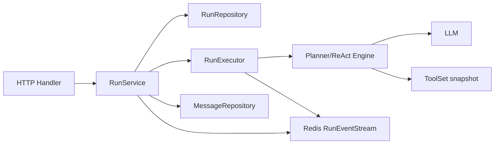

# 目标架构：Session、Run 与进程内 Engine

## 1. 适用范围

这是面向当前模块化单体的目标架构。它解决 Session 与一次执行混合、进程内 task 映射承担事实、实时事件无法可靠恢复的问题。它不把系统提前设计成分布式任务平台。

## 2. 核心边界

### Session

保存会话标题、最近消息摘要、未读数、软删除和 `SandboxID`。Session 不再保存执行状态、task ID 或完整事件流。

### Run

表示一次用户请求的执行事实。Run 至少包含：`id`、`session_id`、`status`、错误信息、配置快照、Prompt hash、可恢复执行快照、等待检查点、创建/结束时间和幂等键。

一个 Session 可有多个历史 Run；数据库约束保证一个 Session 同时最多一个 active Run。

### Engine

保留当前 Planner/ReAct/Flow 的实现，负责执行计划、调用 LLM 和工具并返回结构化结果。Engine 不写数据库状态，也不依赖 Handler 或 Repository。

### RunService

负责创建 Run、提交用户输入、取消、查询和条件状态迁移。它是执行事实的唯一业务入口。

### RunExecutor

在进程内启动一次 Engine 执行，持有创建时的 Settings、Prompt 和 `ToolSet` 快照。它通过 RunService 提交持久化状态和结果，通过 EventStream 发布短期实时事件，并在结束时释放 ToolSet；不得绕过服务直接写 Repository。

### EventStream

Redis Stream 只保存短期实时事件，例如文本增量、计划变化、工具展示和终态通知。业务终态不依赖 Redis 是否存在。

## 3. 目标调用链

```mermaid
flowchart LR
    H[HTTP Handler] --> S[RunService]
    S --> R[RunRepository]
    S --> X[RunExecutor]
    X --> E[Planner/ReAct Engine]
    E --> L[LLM]
    E --> T[ToolSet snapshot]
    S --> M[MessageRepository]
    X --> ES[Redis RunEventStream]
    S --> ES
```

依赖方向保持：`handler -> service -> repository/model`，`RunExecutor -> agent/tools`，`agent` 不反向依赖 service 或 handler。

## 4. 状态原则

Run 状态建议使用：`pending`、`running`、`waiting_input`、`cancelling`、`succeeded`、`failed`、`cancelled`、`interrupted`。

- `pending -> running/cancelling/interrupted`
- `running -> waiting_input/succeeded/failed/cancelling/interrupted`
- `waiting_input -> running/cancelling`
- `cancelling -> cancelled`
- 终态不可再次迁移。
- 取消使用条件更新：先把可取消状态迁移为 `cancelling`，阻止成功、失败或继续输入等迟到写入；执行 goroutine 退出并释放 `ToolSet` 后再迁移为 `cancelled`。
- Engine 的迟到结果不得覆盖 `cancelled`、`failed` 或 `interrupted`。
- 进程重启将 `pending`、`running` 标记为 `interrupted`，将没有存活 goroutine 的 `cancelling` 收敛为 `cancelled`；`waiting_input` 只有在执行快照和等待检查点完整时才保持可恢复，否则迁移为带明确错误码的 `interrupted`。

Plan/Step 首期作为 Run 内 JSONB 快照，不单独建立 Plan 历史表；只有当查询、权限或并发需求真实出现时，才拆独立表。

## 5. 等待输入恢复原则

`waiting_input` 是没有存活执行 goroutine 的持久化状态，不持有旧 `ToolSet`。进入该状态时必须原子保存：

- 当前 Plan revision、当前 step ID 和 step 状态。
- 已完成步骤的稳定结果摘要及必要 artifact 引用。
- 等待问题对应的 assistant message ID、step ID 和恢复方式。
- 构造上下文所需的原始用户输入与消息关联。

用户提交回答后，RunService 通过等待消息 ID 建立问题与回答的对应关系，重新获取 Settings、Prompt 和新的 `ToolSet`，按“原始输入 + 已完成步骤摘要 + 当前问题 + 用户回答”重建 Engine Context，并继续原来的等待步骤。快照不完整、revision 不匹配或步骤不存在时不得静默重新规划。

## 6. 数据所有权

| 数据 | 事实来源 |
|---|---|
| Session 元数据 | PostgreSQL `sessions` |
| Run 状态和快照 | PostgreSQL `runs` |
| 用户/助手最终消息 | PostgreSQL `messages` 或等价消息表 |
| 实时增量和 SSE 游标 | Redis Stream，带 TTL |
| Agent 运行期上下文 | Engine/`SimpleMemory`，可丢弃缓存；恢复所需稳定摘要属于 Run 执行快照 |
| 外部工具连接 | ToolProvider/ToolSet 生命周期 |

Redis 丢失时，Run 查询仍应返回终态；SSE 只能报告无法续读或从 PostgreSQL 快照恢复，不能把 Redis 当作唯一业务数据库。

## 7. 演进边界

首期不引入 Worker、Lease、分布式锁、Outbox、永久逐 token 事件溯源、跨实例接管或四层目录迁移。它们不是永久删除的方向，而是在出现以下真实需求后单独设计：

- 多实例必须接管正在运行的 Run 时，再引入 Worker/Lease 或持久化调度队列。
- PostgreSQL 状态与外部消息发布必须保证跨进程最终一致时，再评估 Outbox。
- 产品需要完整重放、审计或逐事件查询时，再评估永久事件模型。
- Plan/Step 需要独立查询、权限、局部并发更新或长期审计时，再拆独立表。
- 多个聚合持续出现同一事务编排模式时，再提炼通用 UnitOfWork。

在这些触发条件出现前，只保留演进接口和数据边界，不预先实现基础设施。
